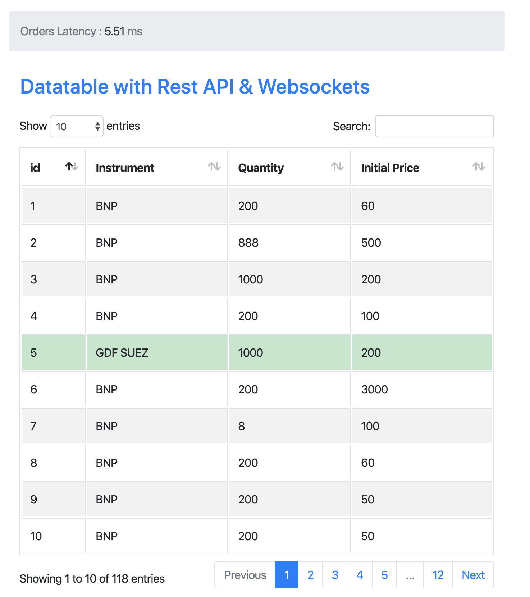
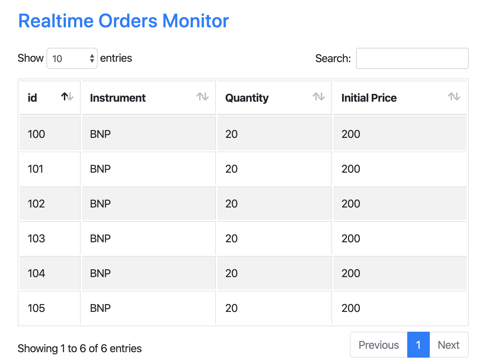

Rest API Datatable & Websockets Incremental Updates
===================================================

Basic example of a an integration between Django Channels, Django Rest API and Datatables to show a realtime
list of orders (instrument, quantity, price), relevant in financial applications, read from the DB. Any new order
or update that occurs on an existing one is propagated to the main page through through websockets notifications.

The orders data is saved in the DB and is served as a jquery datatable that is updated incrementally
via websockets sent whenever a save operation is triggered in the datamodel.

The user gets to see only his own orders through the authentication layer.

After logging to the main page, two datatables are present :

First Datatable :
~~~~~~~~~~~~~~~~~

The first tabls shows the list of user's orders. The data is reading from the Rest API /api/data/?format=datatables
and loads only the needed data in the page because of the setting ("deferRender": true). When an update
of an existing data through the admin, Rest API or else occurs, a websocket notification is sent and the corresponding
row is ameneded (if in the list of appearing rows (example in green in the figure below)). In case of a new data entry,
the current results page within the datatable are reloaded as there is no available way to add new rows in the current
Datatable framework when the data are served from a a server side.

Second Datatable :
~~~~~~~~~~~~~~~~~~

The second datatable is a monitoring screen filled only when the realtime is activated through the green button on top.
It shows all the new datae ntries that are received through the websocket channels (it's like a websocket monitor).

To measure the advantages of using websockets, we calculate the time since the trigger of the notification until
when it is received by the Javascript layer and we show it in the page header (it takes currently 6 ms for a new order
update or insertion to reach the loaded page when the realtime is activated).

The application uses the Django auth system to provide user accounts; users are only able to
subscribe to realtime updates on their data. The code checks the user credentials on incoming
WebSockets to allow users to subscribe to data streams based on their staff status.

Installation
------------

Manual installation
~~~~~~~~~~~~~~~~~~~

Make a new virtualenv for the project, and run::

    pip install -r requirements.txt

Then, you'll need Redis running locally (refer to the next section on Redis deployment); the settings are configured to
point to ``localhost``, port ``6379``, but you can change this in the
``CHANNEL_LAYERS`` setting in ``settings.py``.

Finally, run::

    python manage.py migrate
    python manage.py runserver

Redis Docker Run
~~~~~~~~~~~~~~~~
You need to have docker deployed in order to run a live instance of Redis.

Run the app::

    docker run -p 6379:6379 -d redis:2.8

Usage
-----
Make yourself a superuser account::

    python manage.py createsuperuser

Then, log into http://localhost:8000/admin/ and add some data to the Data model and test that
the results are updated.

You can also use the shell command already available in the application to create a superuser (admin/admin)::

    ./create_superuser.sh

Once logged in, you'll need to open http://localhost:8000/api/data to add/update data through the Rest API.
In parallel, you should have another open session with a subscription to realtime triggered.

There's a single consumer, which you can see routed to in ``webapp/routing.py``,
which is wrapped in the Channels authentication ASGI middleware so it can check
that your user is logged in and retrieve it to check access as you ask to join
rooms.

Whenever the client asks to activate realtime (through the button on top of the page), it sends a
WebSocket text frame with a JSON encoded command to create a new group within the channel
that is linked to the connected user.

When a new update is triggered from the save method overload within the model, a message
is sent (if the user is logged)

Next Actions
------------

* Add a new websocket channel to serve market data via websockets and measure the
resulting performance.

Further Reading
---------------
You can find the Channels documentation at http://channels.readthedocs.org

Sources
---------------
This work is based on the channel examples made by Andrew Godwin in https://github.com/andrewgodwin/channels-examples
